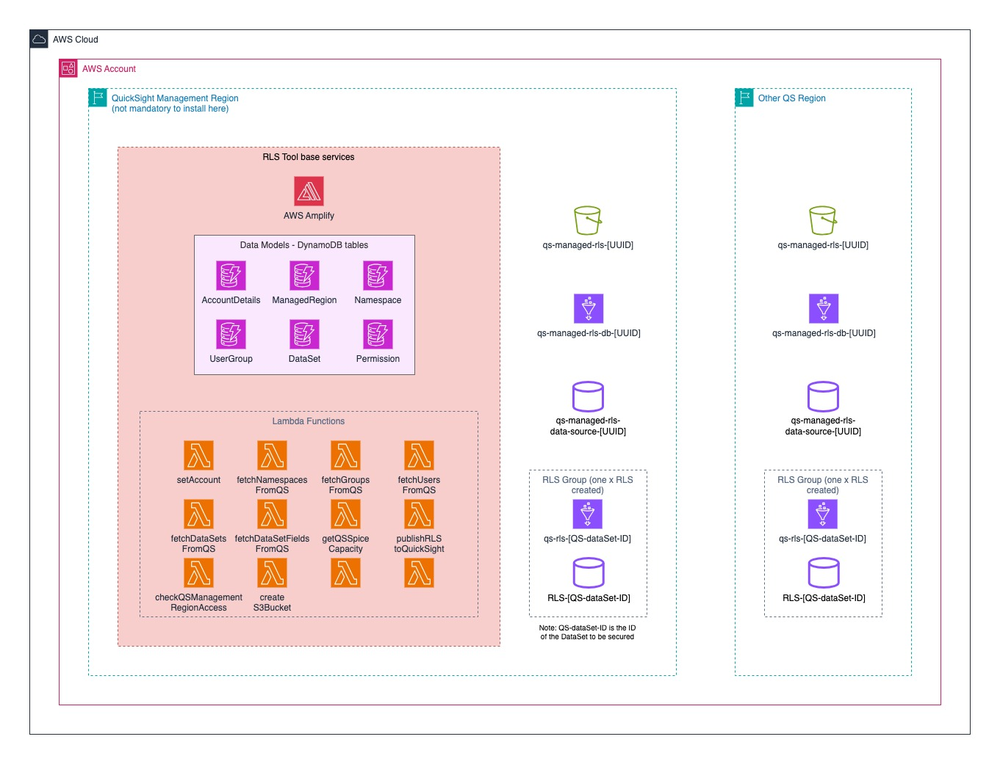

# QuickSight Row Level Security Manager

QuickSight Managed Row Level Security Manager developed by *andrepgn@amazon.com*.
Please refer to andrepgn for any hint, bug, or improvement idea.

## The Idea

A lot of customers, when working with Row Level Security, find it's difficult to keep it updated and quickly understand who-can-see-what.
Especially, when great number of users is involved, it's difficult to keep track of everything. Also, using a CSV-like format to update a new DataSet to then update the DataSet to be secured is a process that can easily lead to errors that can expose wrong data to wrong teams/person.

From this starting point came the idea to use the QuickSight APIs to build a solution to manage RLS in an easier way.

Also, using Amplify permits to define a complete solution that can be launched in any AWS Account in few simple steps. Amplify is comlpetely demanded to manage all the services involved, creating, updating and deleting what is necessary to make the **RLS Manager** work.

The resources created will permit to manage the Permissions in an easier way and then take advantage of the QuickSight APIs to push the Permissions to QuickSight.

### How QuickSight resources are separated in AWS Regions

When you first create a QuickSight account, you select an AWS Region to be your QuickSight Management Region. This is the Region where the management of QuickSight, like management of Groups and Users, is done.

There are other resources that spans over Regions, and other that are linked to an AWS Region.

In QuickSight the following resources are linked to a specific AWS Region:

- DataSources
- DataSets
- Dashboards
- Analyses
- [SPICE](https://docs.aws.amazon.com/quicksight/latest/user/spice.html)

There resources are not linked to a specific AWS Region, even if the access management is possible only in the QuickSight Management Region.

- Groups
- Users
- Namespaces

Please refer to this blogpost to see the topic more in details: [Understanding Namespaces, Groups, Users and Shared Folder in Amazon QuickSight](https://community.amazonquicksight.com/t/understanding-namespaces-groups-users-and-shared-folder-in-amazon-quicksight/13158)

### What do you need to enable RLS

When you want to enable RLS on a specific QuickSight DataSet, you basically need to create another DataSet, created with a specific format, where the permissions you need are saved. Each time you want to change the permissions, you have to change the source and update the DataSet.

To automatically do all this, the idea behind this solution is to create a RLS-DataSet for you and udpate the DataSet to be secured with the RLS saved in the RLS-DataSet.
The RLS-DataSet is based on a Athena query. Athena will get the data from an S3 bucket.

So for each Region and RLS-DataSet you create, this solution will create for you:

- a CSV file in a specific path in an S3 Bucket named _qs-managed-rls-[UUID]_, with a path defined by the DataSet to be secured ID. Resources created are:
  - One bucket per Region
  - A path for each DataSet secured and a CSV file (versioned)
- a Glue Database whit a Glue Table which is used to read the data from the CSV. Resources created are:
  - A Glue Database per Region
  - A Glue Table for each DataSet secured
- A QuickSight Athena DataSource for each Region and a DataSet for each RLS-DataSet created.

### Architecture

Amplify will generate for you all the resources needed and will provide a UI to easily access, control and manage the Permissions.

To see details on the Architecture, go to this page: [Amplify Resources](/Guide/Amplify-Resources.md)

There is a part of resources (_RLS Manager base services_) which is deployed when you launch Amplify.

Then the other resources will depend of the choices you made.

## Guide

A step-by-step guide is available here: [read the Guide](/Guide/TheGuide.md).
